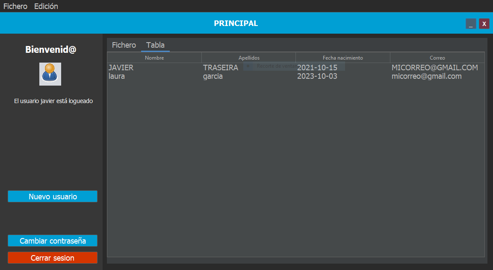
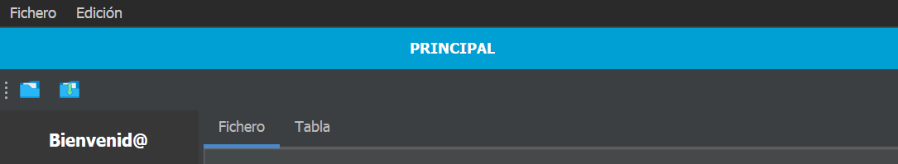

# Práctica 3.2 Agregar otros elementos y conversión a Maven. 

Esta práctica sirve para encaminar la entrega del **primer proyecto trimestral** evaluable del módulo de Desarrollo de Interfaces.

## Parte 1

Crea un nuevo proyecto utilizando **Maven** y copia las clases y paquetes del antiguo proyecto en el nuevo:
- Busca y resuelve las **dependencias** usadas por Maven para lograr hacerlo funcionar.
- Empaqueta nuevamente el proyecto en formato *JAR* y genera el ejecutable.

## Parte 2 (opcional)

Agrega un *JTabbedPane* con al menos dos pestañas en el panel principal:

- Una pestaña para mostrar el campo de contenido del fichero de texto. Agrega la opción para poder editar su contenido y también poder guardar los cambios desde el menú archivo.
- Añade otra pestaña que muestre un *JTable* que sea el resultado de consultar el contenido de los usuarios dados de alta actualmente en el sistema, mostrando todos sus campos en diferentes columnas.

Dentro de la ventana del **selector de color** haz lo propio creando otras dos pestañas; una para seleccionar el color de fondo de la interfaz y la otra para el color de las barras de título.

## Parte 3 (opcional)

Mejora la ventana creando una *JToolbar* superior con los botones de acción rápida más utilizados (abrir, guardar) con sus respectivos iconos.

Opcional: agrega un botón deshacer relativo al texto introducido en la pestaña de fichero así como la opción de copiar y pegar.

Opcional: Implementa la libería *Flatlaf* en tu proyecto e implementála. Ayúdate de su implementación para usar iconos en formato *svg*.

